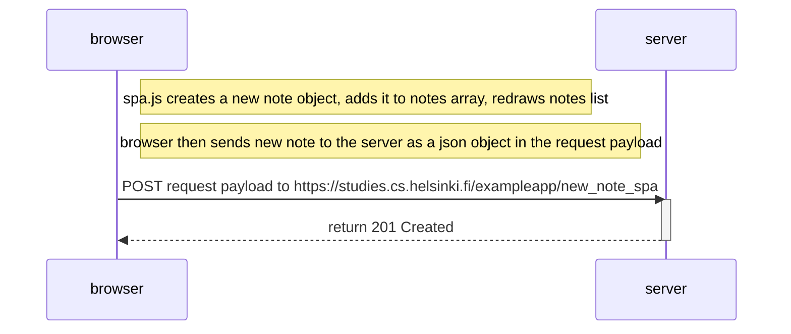

```mermaid
sequenceDiagram
    participant browser
    participant server

    Note right of browser: spa.js creates a new note object, adds it to notes array, redraws notes list
    Note right of browser: browser then sends new note to the server as a json object in the request payload

    browser->>server: POST request payload to https://studies.cs.helsinki.fi/exampleapp/new_note_spa
    activate server
    server-->>browser: return 201 Created
    deactivate server
```    